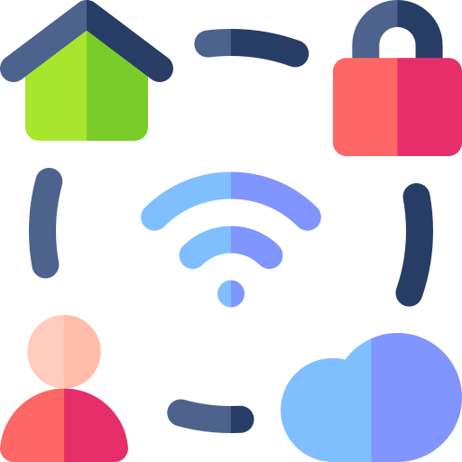
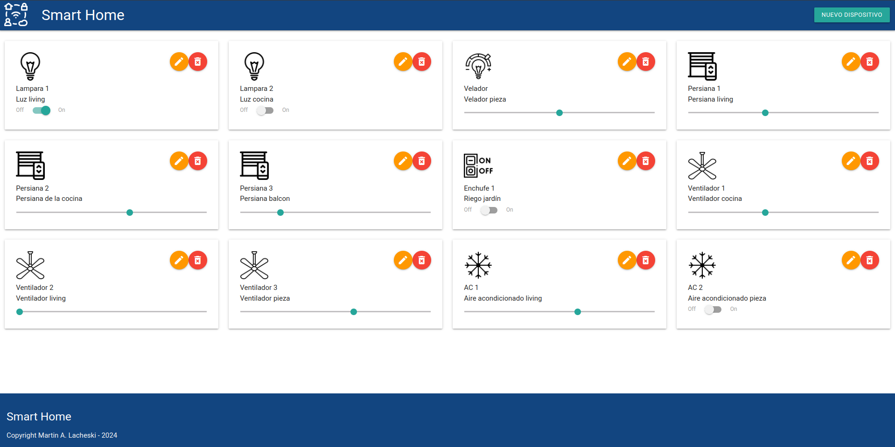

<a href="">
    <span>Smart Home Web App</span>
    
</a>


- [Introducción](#introducción)
- [Web App Smart Home](#web-app-smart-home)
- [Inicialización 🚀](#inicialización-)
  - [Instalar las dependencias](#instalar-las-dependencias)
  - [Descargar el código](#descargar-el-código)
  - [Ejecutar la aplicación](#ejecutar-la-aplicación)
  - [Detener la aplicación](#detener-la-aplicación)
  - [Acceder a la aplicación](#acceder-a-la-aplicación)
- [Configuraciones de funcionamiento 🔩](#configuraciones-de-funcionamiento-)
  - [Configuración de la DB](#configuración-de-la-db)
  - [Estructura de la DB](#estructura-de-la-db)
- [Detalles principales 🔍](#detalles-principales-)
  - [Arquitectura de la aplicación](#arquitectura-de-la-aplicación)
  - [El cliente web](#el-cliente-web)
  - [El servicio web](#el-servicio-web)
  - [La base de datos](#la-base-de-datos)
  - [El administrador de la DB](#el-administrador-de-la-db)
  - [El compilador de TypeScript](#el-compilador-de-typescript)
  - [Ejecución de servicios](#ejecución-de-servicios)
  - [Organización del proyecto](#organización-del-proyecto)
- [Detalles de implementación 💻](#detalles-de-implementación-)
  - [Agregar un dispositivo](#agregar-un-dispositivo)
  - [Frontend](#frontend)
  - [Backend](#backend)
- [Tecnologías utilizadas 🛠️](#tecnologías-utilizadas-️)
- [Contribuir 🖇️](#contribuir-️)
- [Autor 👥](#autor-)
- [Licencia 📄](#licencia-)

## Introducción

El proyecto corresponde al trabajo final realizado para la asignatura **Desarrollo de Aplicaciones Web** de la *Especialización en Internet de las Cosas* dictada en la *Facultad de Ingenieria* de la *Universidad de Buenos Aires*.

## Web App Smart Home

Este proyecto es una aplicación web fullstack que se ejecuta sobre el ecosistema `Docker`. Está compuesta por un compilador de `TypeScript` que permite utilizar un `cliente web`. También tiene un servicio en `NodeJS` que permite ejecutar código en backend y al mismo tiempo disponibilizar el código del cliente web para interactar con el servicio. Además tiene una `base de datos` MySQL que permite interactuar con el backend para guardar y consultar datos, y de manera adicional trae un `administrador` de base de datos para poder administrar la base en caso que lo necesites.

La base de datos consta de una tabla `Devices` con los campos `id` de tipo **integer** y autoincremental, `name` de tipo **string(64)**, `description` de tipo **string(128)**, `state` de tipo **decimal(10,1)** y `type` de tipo **integer**, que referencia a un tipo especificado de dispositivo.

En esta instancia del proyecto los tipos de dispositivos son especificados manualmente. En futuras iteraciones se creará la tabla `Type Devices` a fin de guardar la información y el icono correspondiente al tipo de dispositivo.

Además, próximamente, la aplicación permitirá controlar desde el navegador el estado de los dispositivos de un hogar inteligente - *como pueden ser luces, TVs, ventiladores, persianas, enchufes y otros* - y almacenar los estados de cada uno en la base de datos. 

En esta imagen se puede visualizar una captura de pantalla del cliente web que controla los artefactos del hogar.



## Inicialización 🚀

Esta sección es una guía con los pasos esenciales para que se pueda poner en marcha la aplicación.

<details><summary><b>Mirar los pasos necesarios</b></summary><br>

### Instalar las dependencias

Para correr este proyecto es necesario que se instale `Docker` y `Docker Compose`. 

En [este artículo](https://www.gotoiot.com/pages/articles/docker_installation_linux/) publicado se encuentran los detalles para instalar Docker y Docker Compose en una máquina Linux.

En caso que se quiera instalar las herramientas en otra plataforma o tengas algún incoveniente, se puede leer la documentación oficial de [Docker](https://docs.docker.com/get-docker/) y también la de [Docker Compose](https://docs.docker.com/compose/install/).

Continuar con la descarga del código cuando las dependencias estén instaladas y funcionando.

### Descargar el código

Para descargar el código, lo más conveniente es realizar un `fork` de este proyecto en tu cuenta personal haciendo click en [este link](https://github.com/martinlacheski/app-fullstack-base-2024-i10/fork). Una vez que ya tengas el fork a tu cuenta, descargalo con este comando (acordate de poner tu usuario en el link):

```
git clone https://github.com/USUARIO/app-fullstack-base-2024-i10.git
```

> En caso que no se posea una cuenta en Github se puede clonar directamente este repositorio.

### Ejecutar la aplicación

Para ejecutar la aplicación se tiene que correr el comando desde la raíz del proyecto: 

```sh
docker-compose up
```
Este comando va a descargar las imágenes de Docker de node, de typescript, de la base datos y del admin de la DB, y luego ponerlas en funcionamiento. 

### Detener la aplicación

Para detener la aplicación es necesario ejecutar el siguiente comando:

```sh
docker-compose down
```
También es posible realizar `Ctrl-C` desde el shell o terminal donde se encuentra corriendo el sistema.

### Acceder a la aplicación

Para acceder al cliente web ingresar a a la URL [http://localhost:8000/](http://localhost:8000/) y para acceder al admin de la DB acceder a [localhost:8001/](http://localhost:8001/). 

Si se pudo acceder al cliente web y al administrador significa que la aplicación se ejecuta correctamente. 

> Si aparece un error la primera vez que se corre la aplicación, detener el proceso y volver a iniciarla. Esto es debido a que el backend espera que la base de datos esté creada al iniciar, y en la primera ejecución puede no alcanzar a crearse. A partir de la segunda vez el problema queda solucionado.

</details>

Continuar explorando el proyecto una vez que esté funcionando.

## Configuraciones de funcionamiento 🔩

Al crearse la aplicación se ejecutan los contenedores de Docker de cada servicio, se crea la base de datos y sus tablas. A continuación se puede encontrar información si se quiere cambiar la estructura de la DB o bien sus configuraciones de acceso.

<details><summary><b>Leer cómo configurar la aplicación</b></summary><br>

### Configuración de la DB

Para acceder a **PHPMyAdmin** se tiene que ingresar en la URL [localhost:8001/](http://localhost:8001/). En el login del administrador, el usuario para acceder a la db es `root` y contraseña es la variable `MYSQL_ROOT_PASSWORD` que se encuentra en el archivo `docker-compose.yml`.

Para el caso del servicio de NodeJS que se comunica con la DB fijarse que en el archivo `src/backend/mysql-connector.js` están los datos de acceso para ingresar a la base.

Si quisiera cambiar la contraseña, puertos, hostname u otras configuraciones de la base de datos se debería modificar primero el servicio de la base de datos en el archivo `docker-compose.yml` y luego actualizar las configuraciones para acceder desde PHPMyAdmin y el servicio de NodeJS.

### Estructura de la DB

Al iniciar el servicio de la base de datos, si esta no está creada, toma los datos del archivo que se encuentra en `db/dumps/smart_home.sql` para crear la base de datos automáticamente.

En ese archivo está la configuración de la tabla `Devices` y otras configuraciones más. Si se quisiera cambiar algunas configuraciones se debería modificar este archivo y crear nuevamente la base de datos para que se tomen en cuenta los cambios.

Tener en cuenta que la base de datos se crea con permisos de **superusuario** por lo que no se podrá borrar el directorio con el usuario de sistema, para eso se debe hacer con permisos de administrador. En ese caso se puede ejecutar el comando `sudo rm -r db/data` para borrar el directorio completo.

</details>


## Detalles principales 🔍

En esta sección se encuentran las características más relevantes del proyecto.

<details><summary><b>Mirar los detalles más importantes de la aplicación</b></summary><br>
<br>

### Arquitectura de la aplicación

Como se pudo ver, la aplicación se ejecuta sobre el ecosistema Docker, y en esta imagen se puede ver el diagrama de arquitectura.


### El cliente web

El cliente web es una Single Page Application que se comunica con el servicio en NodeJS mediante JSON a través de requests HTTP. Se puede consultar el estado de dispositivos en la base de datos (por medio del servicio en NodeJS) y también cambiar el estado de los mismos. Los estilos del código están basados en **Material Design**.

### El servicio web

El servicio en **NodeJS** posee distintos endpoints para comunicarse con el cliente web mediante requests HTTP enviando **JSON** en cada transacción. Procesando estos requests es capaz de comunicarse con la base de datos para consultar y controlar el estado de los dispositivos, y devolverle una respuesta al cliente web también en formato JSON. Así mismo el servicio es capaz de servir el código del cliente web.

### La base de datos

La base de datos se comunica con el servicio de NodeJS y permite almacenar el estado de los dispositivos en la tabla **Devices**. Ejecuta un motor **MySQL versión 5.7** y permite que la comunicación con sus clientes pueda realizarse usando usuario y contraseña en texto plano. En versiones posteriores es necesario brindar claves de acceso, por este motivo la versión 5.7 es bastante utilizada para fases de desarrollo.

### El administrador de la DB

Para esta aplicación se usa **PHPMyAdmin**, que es un administrador de base de datos web muy utilizado y que se puede utilizar en caso que se quiera realizar operaciones con la base, como crear tablas, modificar columnas, hacer consultas y otras cosas más.

### El compilador de TypeScript

**TypeScript** es un lenguaje de programación libre y de código abierto desarrollado y mantenido por Microsoft. Es un superconjunto de JavaScript, que esencialmente añade tipos estáticos y objetos basados en clases. Para esta aplicación se usa un compilador de TypeScript basado en una imagen de [Harmish](https://hub.docker.com/r/harmish) en Dockerhub, y está configurado para monitorear en tiempo real los cambios que se realizan sobre el directorio **src/frontend/ts** y automáticamente generar código compilado a JavaScript en el directorio  **src/frontend/js**. Los mensajes del compilador aparecen automáticamente en la terminal al ejecutar el comando **docker-compose up**.

### Ejecución de servicios

Los servicios de la aplicación se ejecutan sobre **contenedores de Docker**, así se pueden desplegar de igual manera en diferentes plataformas. Los detalles sobre cómo funcionan los servicios los podés ver directamente en el archivo **docker-compose.yml**.

### Organización del proyecto

En la siguiente ilustración se puede ver cómo está organizado el proyecto para que tener en claro qué cosas hay en cada lugar.

```sh
├── db                          # directorio de la DB
│   ├── data                    # estructura y datos de la DB
│   └── dumps                   # directorio de estructuras de la DB
│       └── smart_home.sql      # estructura con la base de datos "smart_home"
├── doc                         # documentacion general del proyecto
└── src                         # directorio codigo fuente
│   ├── backend                 # directorio para el backend de la aplicacion
│   │   ├── index.js            # codigo principal del backend
│   │   ├── mysql-connector.js  # codigo de conexion a la base de datos
│   │   ├── package.json        # configuracion de proyecto NodeJS
│   │   └── package-lock.json   # configuracion de proyecto NodeJS
│   └── frontend                # directorio para el frontend de la aplicacion
│       ├── js                  # codigo javascript que se compila automáticamente
│       ├── static              # donde alojan archivos de estilos, imagenes, fuentes, etc.
│       ├── ts                  # donde se encuentra el codigo TypeScript a desarrollar
│       └── index.html          # archivo principal del cliente HTML
├── docker-compose.yml          # archivo donde se aloja la configuracion completa
├── README.md                   # este archivo
├── CHANGELOG.md                # archivo para guardar los cambios del proyecto
├── LICENSE.md                  # licencia del proyecto
```

> Los cambios y avances del proyecto se ven reflejados en el archivo `CHANGELOG.md`.

</details>

## Detalles de implementación 💻

En esta sección pse puede ver los detalles específicos de funcionamiento del código.

<details><summary><b>Mirar los detalles de implementación</b></summary><br>

### Agregar un dispositivo

Para crear un nuevo dispositivo se debe hacer clic en el botón `Nuevo dispositivo`. Esto abrirá un modal, en el cual debe seleccionarse el `Tipo de dispositivo`, ingresar el `Nombre` y la `Descripción` del dispositivo. Una vez realizado esto, se debe hacer clic en el botón `Guardar`. Seguido a esto, el modal se cerrará y el nuevo dispositivo podrá verse reflejado en el listado.

### Frontend

El frontend se desarrolló con una lista desordenada `ul`, en el cual, se incorpora por cada fila hasta 4 dispositivos como máximo. La aplicación es responsiva y adaptable a diversos dispositivos.
Cada dispositivo incorpora botones para poder realizar las operaciones de actualización (que permite cambiar el tipo de dispositivo, el nombre y la descripción) y de eliminación del dispositivo. Además, incorpora un elemento de tipo `checkbox` o `range` según el tipo de dispositivo, a fin de enviar la acción para cambiar dicho estado.
Por otro lado, se utiliza **Material Design** para la interacción y envío de alertas. Se implementa para el `modal` que permite realizar la creación y actualización de dispositivos, así como tambien se implementa para `toast`, que permite enviar las alertas de manera discreta y agradable a la vista.

### Backend

El backend tiene los elementos necesarios para interactuar con el frontend y la base de datos.

La siguiente tabla tiene el resumen de los endpoints implementados en esta versión.

| Método | Punto Final  | Uso                                 | Recibe                  | Retorna            |
| ------ | ------------ | ----------------------------------- | ----------------------- | ------------------ |
| GET    | /device      | Obtiene los dispositivos existentes |                         | Dispositivos       |
| GET    | /device/{id} | Obtiene un dispositivo determinado  | ID Dispositivo          | Dispositivo        |
| POST   | /device      | Agrega un dispositivo               | Datos Dispositivo       | Respuesta consulta |
| PUT    | /device      | Actualiza datos de un dispositivo   | Datos Dispositivo       | Respuesta consulta |
| PUT    | /device      | Actualiza estado de un dispositivo  | ID Dispositivo y Estado | Respuesta consulta |
| DELETE | /device/{id} | Elimina un dispositivo determinado  | ID Dispositivo          | Respuesta consulta |


<details><summary><b>Ver los endpoints disponibles</b></summary><br>

1) Devolver todos los dispositivos.

```json
{
    "method": "GET",
    "request_headers": "application/json",
    "request_body": "",
    "response_code": 200,
    "request_body": {
        "devices": [      
                        {
                            "id": 1,
                            "name": "Lampara 1",
                            "description": "Luz living",
                            "state": 1,
                            "type": 1
                        },
                        {
                            "id": 2,
                            "name": "Lampara 2",
                            "description": "Luz cocina",
                            "state": 0,
                            "type": 1
                        },
                        {
                            "id": 3,
                            "name": "Velador",
                            "description": "Velador pieza",
                            "state": 0.5,
                            "type": 2
                        },
                        {
                            "id": 4,
                            "name": "Persiana 1",
                            "description": "Persiana living",
                            "state": 0.4,
                            "type": 3
                        },
                        {
                            "id": 5,
                            "name": "Persiana 2",
                            "description": "Persiana de la cocina",
                            "state": 0.6,
                            "type": 3
                        },
                        {
                            "id": 6,
                            "name": "Persiana 3",
                            "description": "Persiana balcon",
                            "state": 0.2,
                            "type": 3
                        },
                        {
                            "id": 7,
                            "name": "Enchufe 1",
                            "description": "Riego jardín",
                            "state": 0,
                            "type": 4
                        },
                        {
                            "id": 8,
                            "name": "Ventilador 1",
                            "description": "Ventilador cocina",
                            "state": 0.4,
                            "type": 5
                        },
                        {
                            "id": 9,
                            "name": "Ventilador 2",
                            "description": "Ventilador living",
                            "state": 0,
                            "type": 5
                        },
                        {
                            "id": 10,
                            "name": "Ventilador 3",
                            "description": "Ventilador pieza",
                            "state": 0.6,
                            "type": 5
                        },
                        {
                            "id": 11,
                            "name": "AC 1",
                            "description": "Aire acondicionado living",
                            "state": 24,
                            "type": 6
                        },
                        {
                            "id": 12,
                            "name": "AC 2",
                            "description": "Aire acondicionado pieza",
                            "state": 0,
                            "type": 6
                        }
                    ]
    },
}
``` 

2) Devolver un determinado dispositivo.

Ejemplo:

```json
{
    "method": "GET",
    "request_headers": "application/json",
    "request_params": id = 1,
    "request_body": "",
    "response_code": 200,
    "request_body": {
        "devices": [
                        {
                            "id": 1,
                            "name": "Lampara 1",
                            "description": "Luz living",
                            "state": 1,
                            "type": 1
                        }
                    ]
    },
}
``` 

3) Crear un dispositivo.

```json
{
    "method": "POST",
    "request_headers": "application/json",
    "request_body": "{
                        "name": "nombre dispositivo",
                        "description": "descripcion dispositivo",
                        "state": "Estado dispositivo (Decimal)",
                        "type": "ID Tipo Dispositivo (Integer)"
                    }",
    "response_code": 204,
    "request_body": {
        "ok": [object Object]
    },
}
``` 

4) Actualizar un dispositivo.

```json
{
    "method": "PUT",
    "request_headers": "application/json",
    "request_body": "{
                        "id": "ID Dispositivo (Integer)",
                        "name": "nombre dispositivo",
                        "description": "descripcion dispositivo",
                        "type": "ID Tipo Dispositivo (Integer)"
                    }",
    "response_code": 204,
    "request_body": {
        "ok": [object Object]
    },
}
``` 

5) Actualizar estado de dispositivo.

```json
{
    "method": "PUT",
    "request_headers": "application/json",
    "request_body": "{
                        "id": "ID Dispositivo (Integer)",
                        "state": "Estado dispositivo",
                    }",
    "response_code": 204,
    "request_body": {
        "ok": [object Object]
    },
}
``` 

6) Eliminar dispositivo.

```json
{
    "method": "DELETE",
    "request_headers": "application/json",
    "request_body": "{
                        "id": "ID Dispositivo (Integer)",
                    }",
    "response_code": 204,
    "request_body": {
        "ok": [object Object]
    },
}

``` 
</details>
</details>

## Tecnologías utilizadas 🛠️

En esta sección se pueden ver las tecnologías más importantes utilizadas.

<details><summary><b>Mirar la lista completa de tecnologías</b></summary><br>

* [Docker](https://www.docker.com/) - Ecosistema que permite la ejecución de contenedores de software.
* [Docker Compose](https://docs.docker.com/compose/) - Herramienta que permite administrar múltiples contenedores de Docker.
* [Node JS](https://nodejs.org/es/) - Motor de ejecución de código JavaScript en backend.
* [MySQL](https://www.mysql.com/) - Base de datos para consultar y almacenar datos.
* [PHPMyAdmin](https://www.phpmyadmin.net/) - Administrador web de base de datos.
* [Material Design](https://material.io/design) - Bibliotecas de estilo responsive para aplicaciones web.
* [TypeScript](https://www.typescriptlang.org/) - Superset de JavaScript tipado y con clases.

</details>

## Contribuir 🖇️

Si desea participar del proyecto, por favor realizar un pull request con las sugerencias y el código.

## Autor 👥

*  **Martin Anibal Lacheski - Año 2024**


## Licencia 📄

Este proyecto está bajo Licencia ([MIT](https://choosealicense.com/licenses/mit/)).

---

